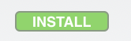
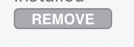
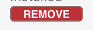

## Munki hacking for Fun

At X World 2017 in Sydney I gave a talk on "Munki Hacking for Fun and Profit". You can watch that [on youtube](https://www.youtube.com/watch?v=L5R3z_xzIHk) if you'd like. I've been meaning to write down what I did and never really got around to doing it so as a first post, I'd like to rectify that.  

What we're doing is not really hacking, but taking advantage of the fact that Managed Software Centre (MSC) renders content in HTML and gives admins the ability to provide customisations via the [client customisation](https://github.com/munki/munki/wiki/Client-Customization) mechanic.

The three files used in MSC are:

- `showcase_template.html` -- controls the banner images and any links
- `sidebar_template.html` -- the right-side sidebar displayed in the main Software view
- `footer_template.html` -- the page footer

**showcase\_template.html** already has some javascript in it for running the rotation of banner images so from this we know that we can run JS code in MSC rendered pages without too much issue. This will come in handy later. **footer\_template.html** though has the distinction of being included on every view displayed in MSC. Taking advantage of this, any javascript or css code in this file will be included with every view rendered in MSC. We can use this to our advantage to take over how items in MSC are displayed.

For a simple example of what we can do, let's look at changing the button colours from the plain grey to something more colourful. The main CSS file for MSC is called **base.css** and you can look at that in all its detail [on github.](https://github.com/munki/munki/blob/279481bfe5516d1d16764ff1bbd7802c2a4eac93/code/apps/Managed%20Software%20Center/Managed%20Software%20Center/WebResources/base.css) We don't need to replicate all of this file, just override the bits that we want to change. I'd encourage digging around just to see how it all comes together though and get an idea of how it's all structured.

The following piece of CSS will override only the **background** value for the small MSC buttons (as shown in category views) to make them green for uninstalled items, with a highlight to a lighter green on hover. Grey for installed items with a red highlight on hover. We also include a small transition time on hover which makes for a more plesent user experience. Paste this into **footer\_template.html** of your customisations and give it a go:

```
<style>
/* give the button a transition time when changing colours */
div.msc-button-inner {
	transition: background-color 0.2s;
}

/* colour of items not installed */
div.msc-button-inner.not-installed:not(.large) {
    background: #53a82f;
}

/* colour of items not installed on hover */
div.msc-button-inner.not-installed:hover {
    background: #7ad85d;
}

/* colour of items installed */
div.msc-button-inner.installed {
    background: #A8AAAF;
}

/* colour of items installed on hover */
div.msc-button-inner.installed:hover {
    background: #cc1a2f;
}
</style>
```

Your INSTALL button for items should now be green:


Hover over it and it should go a lighter shade of green:



The REMOVE button will still look the normal grey:



But hover over it and it should change to red:



A couple of things are going on here. In base.css **div.msc-button-inner** doesn't have a value set for **transition.** We've added that in. Likewise, we added in hover for **div.msc-button-inner.installed** and **div.msc-button-inner.not-installed**. So not only can we change values that are already present, we can add new ones as well.

In this way we can modify various aspects of how items are displayed. You could if you wanted put fat outlines around everything, change the radius of rounded items and generally go nuts...with great power comes great responsibility...but you want to avoid that if at all possible (check the end of my talk for an extreme example of that). Also you don't need to replicate the entire CSS for each button - just the parts you want to change. Care must also be taken to account for Dark Mode.

In part 2 "Munki Hacking for Profit" I'll go through some more advanced changes including some conditional logic to turn MSC into a storefront using some javascript.
