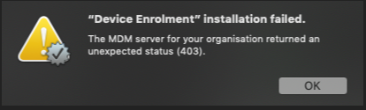

## DEP Nag, Jamf Pro and Unexpected Status (403)

In my org we have been rolling out Jamf Pro MDM to all new Mac devices. We are now extending that to existing devices using the the super cool tool [UMAD](https://github.com/erikng/umad) which I am deploying to existing devices all over the country via our existing [Munki](https://github.com/munki/munki/) setup. This is a nice fancy way to run `sudo profiles renew -type enrollment` and provide a pretty dialog that gives context to the notification the user just got, allowing them ample opportunity to opt in to enrolment at a suitable time, while not letting them forget that they need to enrol (thank you UAMDM).

On a number of devices though, the end users, after accepting the DEP enrolment notification, received the following error:



Fortunately I staged my deployment so the initial batch of 60 odd devices were the only ones targeted for the enrolment notification. Of those devices though, 12 of them had this error - as a failure rate percentage that's way too high.

This error is occurring post push notification but before device enrolment and only on some devices. Initial thoughts were towards some existing configuration getting in the way or an incompatibility with hardware/OS but many were running macOS 10.14.4 and on very recent hardware, although every device was at least a year old or older. The significance of this, I didn't realise until later.

A quick google search and I find out that if you delete the `/Library/Keychains/apsd.keychain` and reboot, everything continues to work. I wasn't super keen on requiring 600 odd devices to have to reboot (I like to avoid reboots if I can at all help it) so decided to look deeper into what was causing the problem.

UPDATE: Here be dragons. Deleting this keychain is **not** recommended by Apple. Doing so may cause an issue with iCloud services. The only supported way to go through DEP re-enrollment is to wipe the device and go through an initial setup where DEP is forced. (thanks Graham Pugh for forwarding on that info).

Taking a look at the Jamf server logs and I start to see entries like this that correspond with when I initially deployed UMAD :

```
...[dEnrollmentIssuerVerifier] - Unable to validate issuer
java.security.cert.CertPathBuilderException: Certification path could not be validated.
...
...Processing device rejection: FAILED_SIGNATURE_CHECK
```

Inspecting the apsd.keychain on the machines with the issue and I discover that the certificate within has expired. Ah - that's why it was only happening on devices that were a year or more older. The certificate is initialised when the OS is first installed/configured and expires after 12 months. The expiry date easily checked with the following:

```
/usr/bin/security find-certificate -a -p -Z /Library/Keychains/apsd.keychain | /usr/bin/openssl x509 -noout -enddate| cut -f2 -d=
```

Initially I thought this was a problem with macOS not renewing the certificate or with our network not allowing comms with 17.0.0.0/8 over whatever port. Turn out it's neither of those things. The (deprecated apparently) document on [OTA Profile Delivery and Configuration](https://developer.apple.com/library/archive/documentation/NetworkingInternet/Conceptual/iPhoneOTAConfiguration/profile-service/profile-service.html#//apple_ref/doc/uid/TP40009505-CH2-SW4) has this little nugget inside (and thank you to @jessepeterson over on the macadmins slack for bringing this to my attention 🍻)

```
WARNING:  When device certificates signed “Apple iPhone Device CA” are evaluated their validity dates should be ignored.
```

So, the MDM is seemingly doing the right thing by checking the validity of certificates but actually they should just ignore the expiry date and just validate that the signing certificate is issued from “Apple iPhone Device CA”.

For now, the only workaround is to delete (or rename) `/Library/Keychains/apsd.keychain`, reboot and try again or manually enrol. So much for ease of deployment to hundreds of remote devices 🤷‍♂️. As it turns out, most of my 600+ devices are are year old or older so either I delete apsd.keychain and force a reboot on all devices or re-do my enrolment workflow.

From what I can tell, this is also a Jamf Pro only thing (and I have raised a support case to look into it further). Other MDM's may behave differently (e.g. [micromdm](https://micromdm.io) will happily accept your profile signed with an expired apsd certificate, as per the mdm spec)

UPDATE:  
It was asked if apsd.keychain was protected by SIP. It isn't (which is a good thing for us so it turns out). You can always check for files and folders protected by SIP by looking in the file `/System/Library/Sandbox/rootless.conf.` Apple's documentation on SIP here https://support.apple.com/en-au/HT204899 also specifically mentions `/Library` as an area applications can continue to write to although there are a number of folders protected by SIP in there. `Keychains` isn't one of them.

References:  
https://github.com/erikng/umad  
https://eclecticlight.co/2017/11/28/more-keychains-than-meets-the-eye/  
https://i.blackhat.com/us-18/Thu-August-9/us-18-Endahl-A-Deep-Dive-Into-macOS-MDM-And-How-It-Can-Be-Compromised-wp.pdf  
https://www.jamf.com/jamf-nation/discussions/14845/getting-expiry-date-of-certificate  
https://www.jamf.com/jamf-nation/discussions/31591/intermittent-client-error-when-prompting-for-enrolment-unexpected-status-403  
https://www.jamf.com/jamf-nation/discussions/29413/device-enrollment-installation-failed-the-mdm-server-for-your-organization-returned-an-unexpected-status-403  
https://simplemdm.com/2017/11/01/user-approved-mdm-enrollment/
