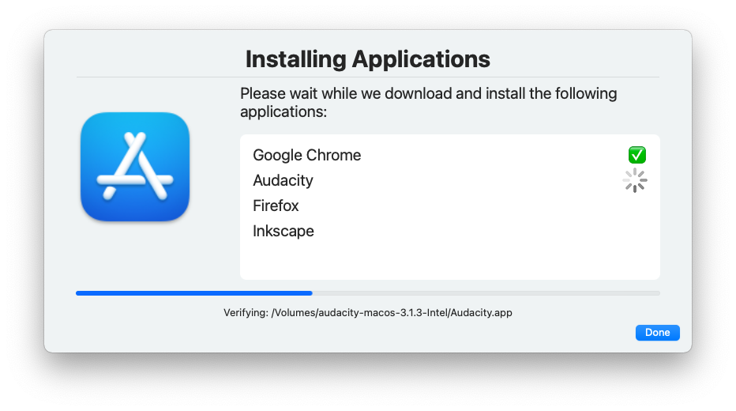

## Things to do with Dialog

It's been 5 months since the [last update](https://breardon.home.blog/2021/09/21/dialog-6-months-later/). Dialog has learned a few more tricks in that time.

As workflows are capable of getting a bit more complex now, I've started a new repository which is going to contain a collection of scripts and is called, unimaginatively enough, [Dialog-scripts](https://github.com/bartreardon/Dialog-scripts). The purpose is to provide a collection of workflows that can be freely copied, modified and used as a basis for other workflows, and hopefully serve as a jumping off point for some of the more adventurous things Dialog can do.

One of the more recent ones lets you send scripted updates to modify content without re-launching. Combined with a list view, this lets you show a list of steps and update with ongoing progress. I've used this as a basis for the first entry to the Dialog-scripts repo that acts as a user-friendly visualisation of [Scripting OS X's](https://scriptingosx.com) awesome [Installomator](https://github.com/Installomator/Installomator) that takes a list of app labels, then steps through them one by one providing feedback as it goes.

<figure>

<figcaption>

Token Screenshot of Dialog doing things

</figcaption>

</figure>

Feel free to copy, modify, update, provide feedback or suggestions. There will be more to come 🙂.

* * *

Dialog is a feature rich open source utility app written in SwiftUI that is intended as a way to provide user notifications and interaction from shell scripts, similar to cocoadialog or jamfHelper. The [latest release](https://github.com/bartreardon/Dialog-public/releases) can be found on the Dialog GitHub page [https://github.com/bartreardon/Dialog](https://github.com/bartreardon/Dialog-public) and also in the [Jamf Marketplace](https://marketplace.jamf.com/details/dialog)
